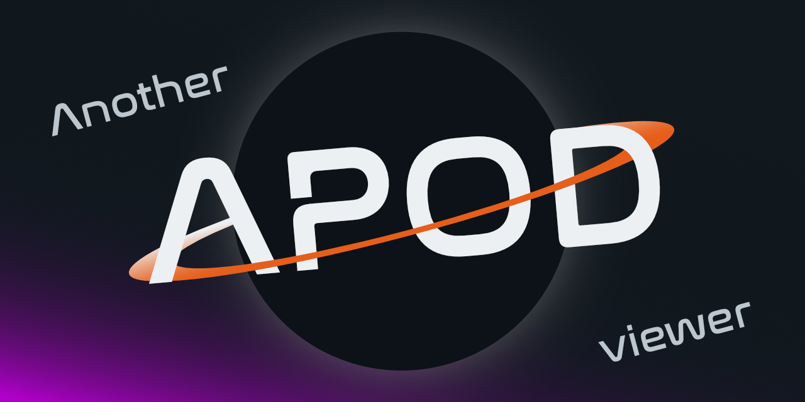

# Another-APOD-viewer



Version 2 of the another-apod-viewer using Nuxt and Nuxt UI, with simpler code. This time the API calls are proxied 💪

Version 1 is in `v1` branch.

## &nbsp; Setup

Make sure to install the dependencies:

```bash
pnpm install
```

## &nbsp;  Development Server

Start the development server on `http://localhost:3000`:

```bash
pnpm run dev
```

## &nbsp;  Production

Build the application for production:

```bash
pnpm run build
```

Locally preview production build:

```bash
pnpm run preview
```

## &nbsp; Linter

```bash
pnpm run lint
pnpm run lint:fix
```

Look at [Nuxt docs](https://nuxt.com/docs/getting-started/introduction) and [Nuxt UI docs](https://ui.nuxt.com) to learn more.
