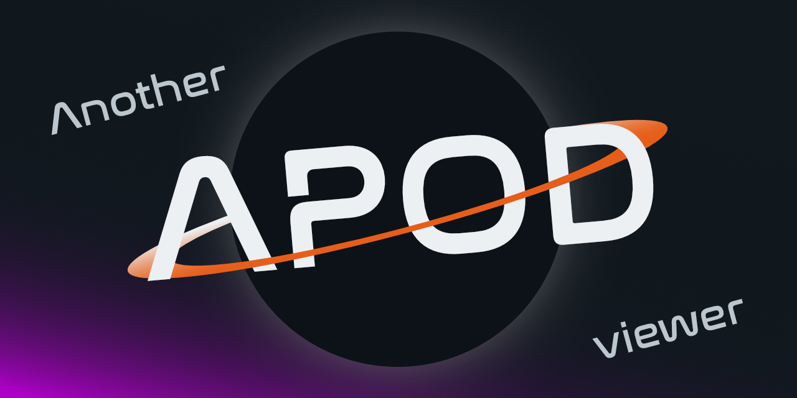
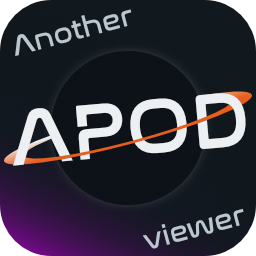

[](https://codecov.io/gh/tcastanie/another-apod-viewer)

Small personal project to improve my skills on Vue, its ecosystem, and everything else. Mainly Vue 3 and its Composition API, Vite, Pinia, Vitest, Github CI... all of this ready to use in a developer-friendly environment.

## &nbsp; Project Setup

```sh
npm install
```

### Compile and Hot-Reload for Development

```sh
npm run dev
```

### Compile and Minify for Production

```sh
npm run build
npm run build:report      # with nice bundle visualization
```

### Run Unit Tests with [Vitest](https://vitest.dev/)

```sh
npm run test
npm run test:v8           # with coverage report
```

### Lint with [ESLint](https://eslint.org/)

```sh
npm run lint
```

## &nbsp; Recommended IDE Setup

[VSCode](https://code.visualstudio.com/) + [Volar](https://marketplace.visualstudio.com/items?itemName=Vue.volar) + [ESLint](https://marketplace.visualstudio.com/items?itemName=dbaeumer.vscode-eslint) + [Stylelint](https://marketplace.visualstudio.com/items?itemName=stylelint.vscode-stylelint)

See `/.vscode` folder for config.

## &nbsp; Assets from the future


